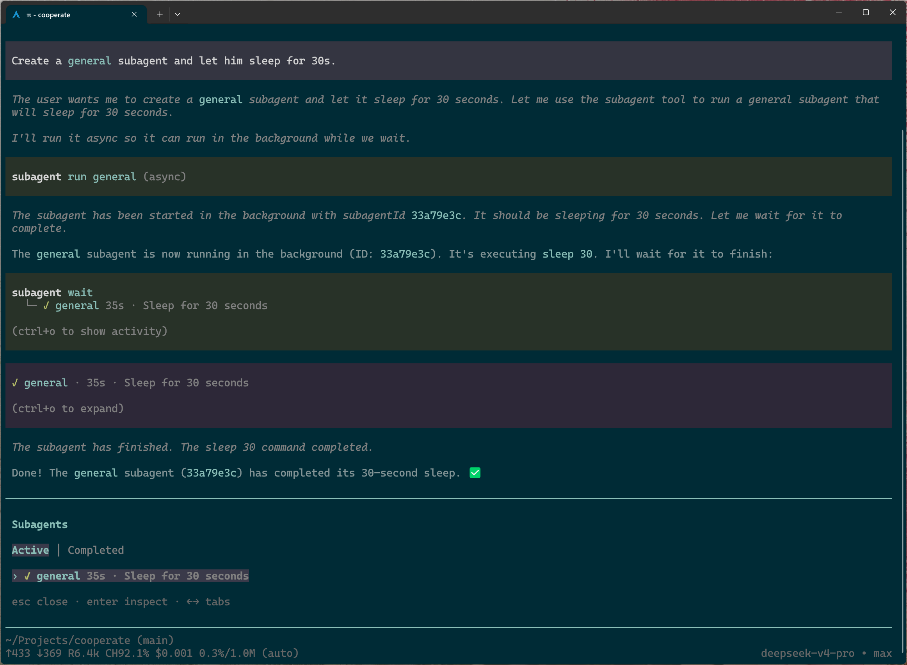

# cooperate

A minimal subagent extension for Pi.

I created it because I couldn't find a subagent implementation for Pi that really fit my preferences.

Most existing implementations come with more features than I need, so I designed cooperate to stay simple and focused.

It provides only the subagent functionality that I think is enough for most use cases. No prebuilt subagents, no bundled workflows, and no long list of commands — just the subagent system itself.



## Features

- Core subagent functionality with support for nested and asynchronous/background subagents, as well as session reuse.
- A clean, polished TUI renderer for tool calls that fits naturally with Pi's design style.
- A `/subagents` command for inspecting active and completed subagent runs.
- Deep integration with Pi's session system. It automatically cleans up subagent run records and sessions associated with deleted parent sessions, and copies them along when you fork a Pi session.

## Installation

I haven't published this extension to npm yet. For now, you can install it directly from this GitHub repository:

```bash
pi install git:github.com/nostalfinals/cooperate
```

By default, Pi will update the extension to the latest commit on the `main` branch whenever you run `pi update --extensions`.

If you want to pin it to a specific commit, run:

```bash
pi install git:github.com/nostalfinals/cooperate@<full-length commit hash>
```

If you're using a sandbox or bash guard extension, it's also recommended to allow your agent to read the `~/.pi/agent/cooperate/sessions/` directory, as it may need to inspect subagent session data stored there.

## Configuration

Configuration is read from `~/.pi/agent/cooperate/config.json`. If the file or any option is absent, the default value will be used.

```json
{
  "maxDepth": 3,
  "cleanOrphanSessions": true
}
```

| Field | Required | Default | Description |
| --- | --- | --- | --- |
| `maxDepth` | no | `3` | Maximum number of nested subagent levels. Must be an integer of at least 1. |
| `cleanOrphanSessions` | no | `true` | Automatically remove subagent sessions and run records whose associated parent session has been deleted. This cleanup runs every time Pi starts. |

### Subagents

This extension does not include any predefined subagents. You can define your own using `.md` files under `~/.pi/agent/cooperate/subagents/`.

Each file is a Markdown document with a YAML frontmatter block and a body. The frontmatter accepts the following fields:

| Field | Required | Default | Description |
| --- | --- | --- | --- |
| `name` | yes | — | Unique definition name matching `^[A-Za-z0-9_-]+$`. |
| `description` | yes | — | Nonempty description shown to the caller. |
| `tools` | no | empty (no tools allowed) | Comma-separated tool allowlist, e.g. `bash, read`. `*` allows all tools; `-name` removes a tool from that set (exclusions are only allowed together with `*`). |
| `subagents` | no | empty (cannot spawn subagents) | Comma-separated names of definitions this subagent may spawn, e.g. `*, -general`. `*` allows all definitions; `-name` removes one from that set (exclusions are only allowed together with `*`). Spawning also requires `subagent` in `tools`. |
| `model` | no | inherited from the creating session | Exact `provider/modelId` reference, e.g. `openai-codex/gpt-5.6-sol`. |
| `thinking` | no | Pi's default thinking level | One of `off`, `minimal`, `low`, `medium`, `high`, `xhigh`, `max`. |
| `system-prompt-mode` | no | `append` | `append` injects the Markdown body as a role block on top of Pi's base prompt; `override` replaces the entire system prompt with the body. |

The Markdown body holds the subagent's system instructions. Note that a bare `*` must be quoted in YAML (`tools: "*"`), since unquoted `*` is a YAML alias indicator.

See [examples](https://github.com/nostalfinals/cooperate/tree/main/examples/subagents). These are the subagent definitions I use in my daily workflow.
