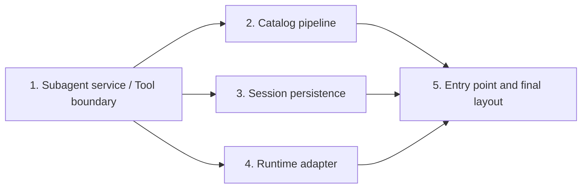

# Implementation Plan: Source modularization

## References

- Specification: `SPEC.md`
- Existing behavior specification: `../subagent-extension/SPEC.md`

## Progress

- [x] Slice 1 — Separate subagent orchestration from the Tool adapter
- [x] Slice 2 — Separate the catalog loading pipeline
- [x] Slice 3 — Separate Session persistence and master lifecycle operations
- [x] Slice 4 — Separate invocation policy from the Pi child runtime adapter
- [x] Slice 5 — Finish the package entry point and module layout

## Current codebase state

The production source contains approximately 2,300 lines across ten top-level TypeScript modules. The largest files are `src/subagent.ts` at 585 lines, `src/catalog.ts` at 348 lines, `src/coordinator.ts` at 268 lines, `src/overlay.ts` at 256 lines, and `src/runtime.ts` at 249 lines.

`src/subagent.ts` currently owns the service, run lifecycle, management actions, TypeBox schema, Pi tool adapter, and tool renderer. `src/catalog.ts` owns filesystem loading through caller schema construction. Tests import implementation symbols directly from the current flat paths, so every move must update matching tests atomically. `package.json` packages the whole `src` directory, and `src/index.ts` is the only Pi extension manifest entry.

At planning time the working tree is clean, all 17 test files and 77 tests pass, and `npm run typecheck` passes. The existing `docs/agent-tasks/subagent-extension/` documents define behavior that this refactor must preserve.

## Execution roadmap

Slices 2, 3, and 4 are independent after Slice 1 establishes the shared types and ports. They may be implemented in any order or in parallel worktrees, but each must begin from the completed Slice 1 boundary.

## Slices

### Slice 1 — Separate subagent orchestration from the Tool adapter

**Status:** Complete

**Outcome**

Subagent execution and direct-child management remain behaviorally unchanged while the application service becomes independent of TypeBox, Pi TUI, and tool rendering. Tool schema, dispatch, results, and rendering become an explicit adapter over the service contract.

**Scope**

- Add `src/subagent/types.ts` for run requests/responses/environments, execution state, terminal causes, and immutable snapshots.
- Add `src/subagent/ports.ts` for the child-runtime, Session-store, continuation, and narrow Tool-facing service contracts where those contracts do not already have a focused owner.
- Move final assistant text extraction and aborted-agent-end detection to `src/subagent/result.ts`.
- Move `StructuredCoordinator` to `src/subagent/coordinator.ts`, retaining its implementation and moving shared public types to `subagent/types.ts`.
- Move `BlockingSubagentService` to `src/subagent/service.ts` and rename it and its options to `SubagentService` and `SubagentServiceOptions`.
- Add `src/tool/schema.ts`, `src/tool/subagent-tool.ts`, and `src/tool/renderer.ts` for the existing action schema, dispatch, result construction, discovery-only fallback, and render callbacks.
- Update production and test imports atomically; remove `src/subagent.ts` once no symbol remains there.
- Preserve action schemas, validation order, error text, update details, renderer text, and synchronous/asynchronous semantics.

**Implementation notes**

- Prefer direct code moves over rewriting methods during this slice.
- Keep `SubagentService` as one cohesive orchestration class even if it remains longer than other modules; do not introduce shared mutable context solely to satisfy a line target.
- Avoid a service-to-tool dependency. The Tool adapter may depend on the service interface, but the service must not construct its own `ToolDefinition`.
- If nested tool construction needs a factory callback, express that dependency through a narrow port rather than importing the Tool adapter into the service implementation.
- Preserve the current discovery-only fallback semantics used when a child runtime has no bound nested coordinator.
- Do not retain a compatibility `src/subagent.ts` barrel.

**Validation**

- `npm test -- test/blocking-run.test.ts test/async-run.test.ts test/management-actions.test.ts test/nested-run.test.ts test/coordinator.test.ts test/structured-cancellation.test.ts test/working-lifecycle.test.ts test/definition-discovery.test.ts` — verifies run behavior, nested coordination, management actions, lifecycle waiting, schema dispatch, and retained errors after the boundary move.
- `npm run typecheck` — verifies all moved contracts, tool callbacks, test imports, and explicit `.ts` paths compile.
- `test ! -e src/subagent.ts && ! rg 'typebox|@earendil-works/pi-tui|presentation' src/subagent/service.ts` — verifies removal of the monolith and the service's adapter independence.

**Dependencies**

- None.

**Completed work**

- Moved subagent contracts, result helpers, coordinator, and renamed orchestration service into focused modules.
- Moved the TypeBox schema, Tool dispatch/results, discovery fallback, and renderer into `src/tool/`; updated production and test imports and removed the old monoliths.

**Validation**

- `npm test -- test/blocking-run.test.ts test/async-run.test.ts test/management-actions.test.ts test/nested-run.test.ts test/coordinator.test.ts test/structured-cancellation.test.ts test/working-lifecycle.test.ts test/definition-discovery.test.ts` — 8 files, 25 tests passed.
- `npm run typecheck` — passed.
- `npm test` — 17 files, 77 tests passed.
- `test ! -e src/subagent.ts && ! rg 'typebox|@earendil-works/pi-tui|presentation' src/subagent/service.ts` — passed.

**Deviations:** None.

### Slice 2 — Separate the catalog loading pipeline

**Status:** Complete

**Outcome**

Configuration loading, Definition parsing, catalog-wide validation, and caller projection are independently readable and testable, while the dynamic Tool schema continues to expose exactly the caller-allowed Definition names.

**Scope**

- Add `src/catalog/types.ts` for configuration, Definition, catalog, load-option, registry, caller projection, and catalog-error types.
- Add `src/catalog/config.ts` for defaults and strict `config.json` loading.
- Add `src/catalog/definitions.ts` for Markdown frontmatter extraction, YAML parsing, Definition field parsing, and deterministic directory loading.
- Add `src/catalog/catalog.ts` for cross-Definition/tool/model validation and `loadCatalog` orchestration.
- Add `src/catalog/caller-catalog.ts` for allowed-Definition projection and exact discovery formatting.
- Remove `agentSchema` from the catalog projection and build the TypeBox/StringEnum schema in `src/tool/schema.ts` from the projected names.
- Update extension, service, runtime, Tool, and test imports; remove the old `src/catalog.ts` module.
- Preserve parsing order, source-path diagnostics, ordering, strict validation, and exact discovery strings.

**Implementation notes**

- Keep filesystem parsing helpers private to the loader that owns them unless another catalog stage genuinely consumes them.
- Do not alter frontmatter preservation, list parsing, model lookup, or all-or-nothing catalog activation.
- The Tool adapter remains the sole owner of schema representation; catalog projections contain data only.
- Do not add catalog barrel exports or retain a compatibility `src/catalog.ts` file.

**Validation**

- `npm test -- test/catalog.test.ts test/definition-discovery.test.ts test/prompt-resolution.test.ts test/package.test.ts` — verifies defaults, strict parsing, validation, caller scoping, exact discovery, prompt integration, and dynamic schemas.
- `npm run typecheck` — verifies all catalog consumers use the new data-only projection and owning module paths.
- `test ! -e src/catalog.ts && ! rg 'typebox|StringEnum|agentSchema' src/catalog` — verifies removal of the monolith and schema concerns from catalog modules.

**Dependencies**

- Slice 1.

**Completed work**

- Split catalog types, configuration loading, Definition parsing, catalog validation, and caller projection into focused modules.
- Moved caller-constrained `StringEnum` schema construction into `src/tool/schema.ts`; updated production/tests and removed `src/catalog.ts`.

**Validation**

- `npm test -- test/catalog.test.ts test/definition-discovery.test.ts test/prompt-resolution.test.ts test/package.test.ts` — 4 files, 39 tests passed.
- `npm test` — 17 files, 77 tests passed.
- `npm run typecheck` — passed.
- `test ! -e src/catalog.ts && ! rg 'typebox|StringEnum|agentSchema' src/catalog` — passed.
- `git diff --check` — passed.

**Deviations:** None.

### Slice 3 — Separate Session persistence and master lifecycle operations

**Status:** Complete

**Outcome**

Ownership parsing, native Session persistence, master namespace copying, orphan cleanup, and bounded text formatting remain behaviorally identical while becoming separate modules with distinct reasons to change.

**Scope**

- Add `src/sessions/ownership.ts` for `OWNERSHIP_ENTRY` and branch-derived `ownedSessionIds`.
- Add `src/sessions/native-store.ts` for Session records/inspection and `NativeSessionStore`, implementing the Session-store port from Slice 1.
- Add `src/sessions/master-copy.ts` for the sessions-root path, master ID extraction, staging copy, and atomic publication.
- Add `src/sessions/orphan-gc.ts` for master discovery, orphan selection, trash adapters, and recursive-removal fallback.
- Add `src/text.ts` for `compactPreview` and `truncateForTool`.
- Keep narrow filesystem helpers with the operation that owns them; duplicate a trivial private existence check if that is clearer than creating a generic filesystem utility.
- Update service, extension, Tool, UI, and test imports; remove `src/sessions.ts` and `src/lifecycle.ts`.
- Preserve native headers, paths, branch visibility, preview/truncation output, copy failure cleanup, GC ordering, and trash fallback behavior.

**Implementation notes**

- Do not change Session JSONL data or rewrite ownership entries during the move.
- `NativeSessionStore` must depend on the port contract rather than defining the contract beside its concrete implementation.
- Keep master copy and orphan GC separate even though both operate below the same sessions root; their failure and safety semantics differ.
- Do not introduce a generic `utils` directory.

**Validation**

- `npm test -- test/sessions.test.ts test/branch-visibility.test.ts test/session-lifecycle.test.ts test/master-fork.test.ts test/orphan-gc.test.ts test/nested-run.test.ts` — verifies native persistence, ownership, branch semantics, lifecycle reuse, namespace copying, cleanup, and nested ownership after the move.
- `npm run typecheck` — verifies concrete storage satisfies the shared port and every path consumer imports the owning module.
- `test ! -e src/sessions.ts && test ! -e src/lifecycle.ts` — verifies removal of both mixed-responsibility modules.

**Dependencies**

- Slice 1.

**Completed work**

- Split ownership parsing, native Session storage, master namespace copying, orphan cleanup, and bounded text helpers into focused modules.
- Updated service, extension, Tool, UI, and tests to use the new Session and text owners; removed `src/sessions.ts` and `src/lifecycle.ts`.

**Validation**

- `npm test -- test/sessions.test.ts test/branch-visibility.test.ts test/session-lifecycle.test.ts test/master-fork.test.ts test/orphan-gc.test.ts test/nested-run.test.ts` — 6 files, 17 tests passed.
- `npm test` — 17 files, 77 tests passed.
- `npm run typecheck` — passed.
- `test ! -e src/sessions.ts && test ! -e src/lifecycle.ts` — passed.
- `git diff --check` — passed.

**Deviations:** None.

### Slice 4 — Separate invocation policy from the Pi child runtime adapter

**Status:** Complete

**Outcome**

Model/thinking selection is isolated from Pi SDK session construction, and the Pi child runtime clearly implements the Slice 1 runtime port without depending on the concrete subagent service.

**Scope**

- Add `src/runtime/invocation-settings.ts` for invocation model/thinking resolution and model-reference formatting.
- Add `src/runtime/pi-child-runtime.ts` for the default SDK adapter, child resource loading, extension binding, exact-tool verification, terminal failure detection, prompt/abort/dispose behavior, and `PiChildRuntimeFactory`.
- Consume child invocation/run/factory contracts from `src/subagent/ports.ts` instead of defining them beside the adapter.
- Preserve continuation binding and nested Tool injection without importing the concrete `SubagentService` into the runtime adapter.
- Update extension and tests to use owning modules; remove the old `src/runtime.ts`.
- Preserve resource ordering, runtime model lookup, global thinking fallback, exact active tools, task-only prompting, terminal failure behavior, and idempotent disposal.

**Implementation notes**

- Keep SDK-shaped private interfaces local to `pi-child-runtime.ts`; they are adapter test seams, not domain contracts.
- Keep pure selection policy free from session creation and extension lifecycle concerns.
- If the discovery-only Tool fallback remains necessary, depend on a narrow Tool factory rather than the service implementation.
- Do not revise Pi integration APIs or error wording during the move.

**Validation**

- `npm test -- test/prompt-resolution.test.ts test/blocking-run.test.ts test/nested-run.test.ts test/async-run.test.ts test/working-lifecycle.test.ts` — verifies invocation policy, resource ordering, exact tools, nested runtime integration, terminal behavior, and structured waiting.
- `npm run typecheck` — verifies the Pi adapter implements the shared runtime contracts.
- `test ! -e src/runtime.ts && ! rg 'SubagentService' src/runtime` — verifies removal of the monolith and independence from the concrete service.

**Dependencies**

- Slice 1.

**Completed work**

- Split invocation model/thinking policy from the Pi child-runtime SDK adapter.
- Updated the extension and runtime tests to the new owning modules and removed `src/runtime.ts`; the adapter retains discovery fallback and has no `SubagentService` dependency.

**Validation**

- `npm test -- test/prompt-resolution.test.ts test/blocking-run.test.ts test/nested-run.test.ts test/async-run.test.ts test/working-lifecycle.test.ts` — 5 files, 16 tests passed.
- `npm test` — 17 files, 77 tests passed.
- `npm run typecheck` — passed.
- `test ! -e src/runtime.ts && ! rg 'SubagentService' src/runtime` — passed.
- `git diff --check` — passed.

**Deviations:** None.

### Slice 5 — Finish the package entry point and module layout

**Status:** Complete

**Outcome**

The extension loads from a minimal entry point, all concrete implementations are composed in one extension module, UI files occupy their intended boundary, and no old monolith or temporary migration path remains.

**Scope**

- Move `createCooperateExtension`, session-scoped state, Pi event handlers, command registration, and concrete adapter construction to `src/extension.ts`.
- Reduce `src/index.ts` to the named factory exposure and default extension entry required by the Pi package manifest.
- Move `src/presentation.ts` to `src/ui/presentation.ts` and `src/overlay.ts` to `src/ui/subagents-overlay.ts` without splitting or redesigning their component logic.
- Update all remaining imports to direct owning paths.
- Remove obsolete source modules and any temporary compatibility exports introduced during implementation.
- Inspect the final source import graph for reverse adapter dependencies and runtime cycles.
- Leave `src/continuation.ts` and `src/prompt.ts` focused at the top level and leave test files organized by behavior.

**Implementation notes**

- Keep the extension factory's session generation and shutdown race protections intact.
- Preserve package metadata: `pi.extensions` continues to point at `./src/index.ts`, and the package continues to include `src`.
- Do not split event handlers into one-file wrappers or add barrel files for visual symmetry.
- UI movement is path-only; do not attempt the untested overlay view/state-machine split.

**Validation**

- `npm test` — verifies all 17 test files and the complete behavioral contract after all modules have moved.
- `npm run typecheck` — verifies the final module graph and public entry compile against Pi 0.83.0.
- `npm pack --dry-run` — verifies the package still includes the entry point and all required source modules without publishing.
- `PI_OFFLINE=1 pi -e . --help` — verifies Pi can load the reorganized package without network access or model credentials; it does not exercise an interactive TUI or real model invocation.
- `test "$(find src -maxdepth 1 -type f -printf '%f\n' | sort | paste -sd, -)" = "continuation.ts,extension.ts,index.ts,prompt.ts,text.ts"` — verifies only the approved focused modules remain at the source root.
- `git diff --check` — verifies the completed structural diff has no whitespace errors.

**Dependencies**

- Slice 2.
- Slice 3.
- Slice 4.

**Completed work**

- Moved the composition root to `src/extension.ts`, reduced `src/index.ts` to the named factory/default entry, and moved UI modules under `src/ui/`.
- Updated all owning imports and verified the final source layout, package contents, and offline Pi loading.

**Validation**

- `npm test` — 17 files, 77 tests passed.
- `npm run typecheck` — passed.
- `npm pack --dry-run` — passed; package contains the entry point and reorganized source.
- `PI_OFFLINE=1 pi -e . --help` — passed.
- `test "$(find src -maxdepth 1 -type f -printf '%f\\n' | sort | paste -sd, -)" = "continuation.ts,extension.ts,index.ts,prompt.ts,text.ts"` — passed.
- `git diff --check` — passed.

**Deviations:** None.

## Final verification

- `npm test` — all existing deterministic behavior remains green.
- `npm run typecheck` — all final module boundaries and Pi API uses compile.
- `npm pack --dry-run` — the private package contains the complete reorganized source.
- `PI_OFFLINE=1 pi -e . --help` — the installed Pi loader accepts the extension offline.
- `git diff --check` — the full task diff is structurally clean.
- Review `git diff --stat` and `git status --short` — confirm the task changed only the intended source imports/layout and these task artifacts, while preserving any pre-existing user changes.
