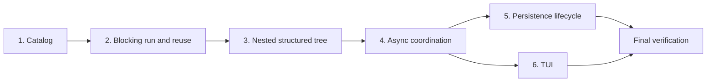

# Implementation Plan: Cooperate subagent extension

## References

- Specification: `SPEC.md`
- Pi extension API: `/home/nostalfinals/.local/share/mise/installs/node/24.18.0/lib/node_modules/@earendil-works/pi-coding-agent/docs/extensions.md`
- Pi SDK: `/home/nostalfinals/.local/share/mise/installs/node/24.18.0/lib/node_modules/@earendil-works/pi-coding-agent/docs/sdk.md`
- Pi TUI: `/home/nostalfinals/.local/share/mise/installs/node/24.18.0/lib/node_modules/@earendil-works/pi-coding-agent/docs/tui.md`
- Pi package conventions: `/home/nostalfinals/.local/share/mise/installs/node/24.18.0/lib/node_modules/@earendil-works/pi-coding-agent/docs/packages.md`
- SDK full-control example: `/home/nostalfinals/.local/share/mise/installs/node/24.18.0/lib/node_modules/@earendil-works/pi-coding-agent/examples/sdk/12-full-control.ts`
- Built-in subagent example: `/home/nostalfinals/.local/share/mise/installs/node/24.18.0/lib/node_modules/@earendil-works/pi-coding-agent/examples/extensions/subagent/`
- Overlay reference: `~/.pi/agent/extensions/model-presets/`
- Tool-rendering reference: `~/.pi/agent/extensions/ui-shell/`

## Progress

- [ ] Slice 1 — Load a strict Definition catalog
- [ ] Slice 2 — Run and resume a blocking direct subagent
- [ ] Slice 3 — Coordinate a nested structured runtime tree
- [ ] Slice 4 — Run asynchronously and manage direct children
- [ ] Slice 5 — Preserve Session semantics across Pi lifecycle changes
- [ ] Slice 6 — Deliver the complete TUI presentation

## Current codebase state

The repository is empty except for these planning artifacts. It is not currently a Git repository and has no package manifest, source, tests, or repository-local instructions. The extension name comes from the repository directory: `cooperate`.

The implementation targets the locally installed Pi 0.83.0 APIs. Pi already provides the essential primitives: ESM TypeScript extension loading, `DefaultResourceLoader` overrides, independent SDK AgentSessions, native JSONL `SessionManager`, custom entries and messages, awaited extension lifecycle handlers, abort signals, dynamic tool renderers, and overlay TUI components.

The implementation should retain explicit seams between pure domain coordination and Pi/filesystem adapters so tests can exercise all required behavior without provider calls, credentials, sleeps, or a real terminal. Keep modules cohesive rather than introducing a framework or generic orchestration layer. A suitable starting layout is:

```text
package.json
src/
  index.ts
  catalog.ts
  coordinator.ts
  runtime.ts
  sessions.ts
  tool.ts
  ui.ts
test/
  fixtures/
  support/
```

This layout is guidance, not a requirement to preserve empty modules or prevent merging modules when the implementation remains clearer.

## Execution roadmap



## Slices

### Slice 1 — Load a strict Definition catalog

**Status:** Pending

**Outcome**

`cooperate` is a loadable local Pi package with a deterministic configuration and Definition catalog. Valid Definitions become the caller-facing dynamic catalog; invalid input fails atomically with actionable source diagnostics.

**Scope**

- Add the ESM TypeScript package manifest, Pi extension manifest entry, TypeScript configuration, Vitest configuration, and npm scripts.
- Declare Pi core packages as `peerDependencies: "*"` and use Pi 0.83.0-compatible development types.
- Add an extension entry point with session-scoped initialization and idempotent shutdown boundaries.
- Resolve `~/.pi/agent/cooperate/config.json` and the direct `subagents/*.md` catalog.
- Parse YAML frontmatter and Markdown bodies, apply defaults, and enforce every catalog constraint in the specification.
- Validate model references against Pi's model registry and tool names against the complete registered tool catalog.
- Derive caller-specific Definition descriptions and constrained `agent` schemas without mutating the global catalog.
- Establish test fixtures and fakes for paths, tool metadata, model registry data, extension context, and cleanup.

**Implementation notes**

- Treat this as the one enabling slice: strict catalog resolution and deterministic test seams are prerequisites for every meaningful run path.
- Keep parsed configuration, validated Definitions, and caller-visible Definition projections as separate types.
- Preserve Definition body bytes after frontmatter parsing except for the required nonempty check; do not reinterpret Markdown.
- Report all source paths as resolved paths. Reject the complete catalog rather than retaining valid files beside invalid files.
- Do not ask for or probe model authentication during catalog loading.
- Avoid module-scope lifecycle state because the same extension factory will run in multiple child runtimes.

**Validation**

- `npm run typecheck` — proves the package and extension entry compile against the targeted Pi APIs.
- `npm test -- test/catalog.test.ts test/package.test.ts` — proves defaults, strict JSON/frontmatter validation, exact references, model/tool validation, atomic failure, and package metadata without loading a model.

**Dependencies**

- None.

### Slice 2 — Run and resume a blocking direct subagent

**Status:** Pending

**Outcome**

The main agent can run one direct child synchronously, receive only its terminal text result, persist the child as native Pi JSONL, list it on the owning branch, and resume it under any currently permitted Definition.

**Scope**

- Register the complete action-discriminated `subagent` tool contract with caller-specific Definition constraints and descriptions.
- Add the child-runtime adapter around Pi's in-process runtime/session APIs and proper runtime bind, start, stop, and disposal behavior.
- Load normal Pi resources for the child and inject the Definition with `appendSystemPromptOverride(base => [...base, body])`.
- Resolve model, authentication, and non-inherited thinking at invocation time.
- Activate exactly the Definition's tool names and revalidate availability before prompting.
- Create native child Sessions in the master-namespaced directory and open existing native JSONL Sessions for reuse.
- Persist direct ownership as a custom entry before exposing a newly created child.
- Resolve ownership against the parent's active branch and enforce the one-live-binding lock.
- Implement blocking `run`, direct `list-subagents`, and branch-visible `list-sessions` behavior for a direct child.
- Extract only the terminal assistant message's last nonempty text block and apply Pi-compatible parent-output truncation without changing the child JSONL.

**Implementation notes**

- Pass only `task` to `session.prompt()`; do not copy parent messages or build a context-fork mode.
- Keep the master namespace explicit in every Session-store operation even though the tool accepts a bare child UUID.
- Use `SessionManager.create(cwd, masterDirectory)` and its native ID/filename rather than generating durable IDs.
- A Session lock must be acquired before runtime startup and released in one `finally` path after full disposal, including startup errors and abort races.
- Definition changes affect the next runtime only. Do not rewrite prior Session entries or infer a Definition from history.
- The blocking path returns an error tool result with Session ID and reason on child failure; cancellation follows the caller's abort signal.
- Make output truncation a shared utility so list previews, blocking results, and later notifications cannot diverge from Pi's ceiling.

**Validation**

- `npm test -- test/blocking-run.test.ts test/sessions.test.ts test/prompt-resolution.test.ts` — proves exact task isolation, native persistence, branch ownership, Definition-independent reuse, lock release, model/thinking precedence, append-slot placement, exact tools, error results, and final-text extraction with fake Pi runtimes.
- `npm run typecheck` — proves the runtime and Session adapters use supported Pi 0.83.0 contracts.

**Dependencies**

- Slice 1.

### Slice 3 — Coordinate a nested structured runtime tree

**Status:** Pending

**Outcome**

Any permitted child can create its own direct children up to `maxDepth`; active bindings form an observable structured tree in which failures are sibling-isolated, cancellation cascades downward, and every parent scope remains alive until its descendants stop.

**Scope**

- Add the in-memory coordinator for root/parent relationships, collision-checked 8-hex-character IDs, Session locks, depth, state, elapsed time, and subtree snapshots.
- Instantiate the scoped `subagent` tool inside child runtimes when it is present in the Definition's exact tool allowlist.
- Restrict nested `run` to the creator Definition's `subagent_agents` and reject over-depth runs before Session creation or locking.
- Track `running` versus `waiting` from the parent's own loop and descendant count.
- Hold each runtime's `agent_end` lifecycle until its descendant scope has terminated.
- Cascade a failed node's cancellation through its descendants while allowing siblings to continue.
- Cascade root/tool abort through the applicable subtree and await complete, idempotent disposal.
- Produce immutable subtree update details suitable for later blocking tool rendering without adding UI in this slice.

**Implementation notes**

- Model ownership between Sessions, not between transient runtime objects. The coordinator may cache resolved direct edges but the persisted custom entry remains authoritative after reload.
- Separate a node's own-loop terminal signal from its scope terminal signal; `waiting` spans the interval between them.
- Use per-node cancellation scopes linked downward, not one global abort controller, so sibling isolation is structural.
- Record only the first terminal cause for a node and make repeated fail/cancel/dispose operations no-ops after the winning transition.
- Suppress descendant cancellation reports at the coordinator boundary; only the failed or explicitly targeted direct child is parent-observable.
- Do not add permits, queues, result caches, retries, or persistent runtime IDs.

**Validation**

- `npm test -- test/coordinator.test.ts test/nested-run.test.ts test/structured-cancellation.test.ts` — proves permission and depth rejection, ID/lock invariants, running-to-waiting transitions, descendant waiting, sibling failure isolation, vertical cancellation, and idempotent race handling under deterministic deferred promises.
- `npm run typecheck` — proves child runtimes can receive the scoped tool without broadening configured tools.

**Dependencies**

- Slice 2.

### Slice 4 — Run asynchronously and manage direct children

**Status:** Pending

**Outcome**

An agent can start direct children asynchronously, continue its own work, list/wait for/cancel those children, and automatically resume when each terminal notification arrives while Pi's native Working state covers the complete descendant tree.

**Scope**

- Implement async `run` startup acknowledgement with `subagentId` and Session ID.
- Add exactly-once terminal custom messages for asynchronous success, failure, and explicit cancellation.
- Route completion as `steer` before the parent's logical loop end and `followUp` while its aggregate `agent_end` is waiting.
- Gate very fast completions until the starting async tool result has been committed.
- Complete direct-active `list-subagents`, persistent `list-sessions`, wait-all `wait`, and subtree `cancel` validation and results.
- Keep each completion independent while allowing Pi's existing message queue to order simultaneous completions.
- Suppress notifications for lifecycle-wide cancellation and cascade-cancelled descendants.
- Include nested usage in tool results when the Pi API supports it, without changing completion content semantics.

**Implementation notes**

- Track the parent's logical phase explicitly; `ctx.isIdle()` alone cannot distinguish an aggregate handler waiting inside `agent_end`.
- `wait` captures valid handles atomically, then waits for every terminal state. It succeeds even if captured children fail or are cancelled because their custom messages carry those outcomes.
- Never cache a completed runtime result for later `wait`; once the active binding is gone, its ID is invalid.
- A blocking invocation must remain message-free even though it uses the same coordinator terminal path.
- Build model-visible notification content separately from renderer-only details. Exclude terminal `subagentId` from both durable model content and any interface that implies resumability.
- Preserve one notification for the explicit cancel target after its subtree is stopped; never emit one per descendant.

**Validation**

- `npm test -- test/async-run.test.ts test/management-actions.test.ts test/continuation.test.ts` — proves prompt return timing, fast-completion gating, exactly-once messages, steer/follow-up selection, uncoalesced completions, direct-child validation, wait-all semantics, explicit cancel reporting, and lifecycle-cancellation suppression.
- `npm test -- test/working-lifecycle.test.ts` — proves the root `agent_end` remains pending through asynchronous descendant work and resolves only after the full tree settles.
- `npm run typecheck` — proves custom-message and lifecycle event usage remains compatible with Pi 0.83.0.

**Dependencies**

- Slice 3.

### Slice 5 — Preserve Session semantics across Pi lifecycle changes

**Status:** Pending

**Outcome**

Child ownership and data remain correct through compaction, branch navigation, master resume, `/fork`, and `/clone`; replacement and shutdown cancel live work safely; startup can remove only genuinely orphaned master directories.

**Scope**

- Reconstruct visible ownership from custom entries on the current `SessionManager.getBranch()` path.
- Refresh branch-derived visibility after tree navigation and verify compaction leaves ownership discoverable.
- On tree navigation, new/resume switch, reload, fork/clone, and exit, stop and await the complete active tree before old runtime teardown completes.
- On `session_start` with `reason: "fork"`, resolve old and new master IDs and clone the complete old child directory into the new namespace.
- Stage clone data in a temporary sibling, atomically rename it, reject destination collisions, and clean failed staging without touching the source.
- Ensure copied nested ownership resolves through unchanged child UUIDs and copied branch paths.
- Detect orphan master directories against Pi's existing master Sessions after required fork copying.
- Implement configured cleanup through `trash` when available with recursive-removal fallback.
- Treat crash-left child JSONL as unlocked, resumable data without synthesizing runtime state or notifications.

**Implementation notes**

- Parse the previous master ID from `previousSessionFile` through Pi Session metadata rather than filename assumptions.
- Complete old runtime disposal before starting the copy so all JSONL writes are flushed.
- Never merge into a pre-existing new-master directory. Surface initialization failure instead of guessing which files win.
- Copy the whole flat directory; branch filtering happens through ownership entries and does not require selecting files during clone.
- Run orphan selection only after fork/clone handling. Make selection and deletion separate, testable operations.
- Resolve fresh absolute paths for `list-sessions`; do not rewrite historical tool results containing old paths.
- Cleanup handlers must remain safe when Pi emits shutdown after an earlier abort or when a replacement operation fails.

**Validation**

- `npm test -- test/branch-visibility.test.ts test/session-lifecycle.test.ts` — proves custom-entry path membership, compaction survival, resume reconstruction, replacement cancellation, crash recovery semantics, and fresh path resolution.
- `npm test -- test/master-fork.test.ts test/orphan-gc.test.ts` — proves byte-equivalent independent copies with unchanged child IDs, nested references, hidden-file behavior, atomic failure cleanup, destination collision rejection, GC ordering, orphan selection, trash use, and fallback removal in temporary directories.
- `npm run typecheck` — proves all Session lifecycle handlers use supported event fields.

**Dependencies**

- Slice 4.

### Slice 6 — Deliver the complete TUI presentation

**Status:** Pending

**Outcome**

Blocking runs, async starts, management actions, terminal messages, and the active runtime tree have the approved compact visual hierarchy, expanded detail, live updates, and keyboard-driven cancellation flow.

**Scope**

- Add action-specific `renderCall` and `renderResult` implementations with the exact headers, title/accent/muted roles, collapsed summaries, and expanded content.
- Feed blocking `run` subtree snapshots through `onUpdate`, including nested hierarchy, state marks, elapsed time, task previews, and retained terminal state.
- Register the `[subagent]` custom-message renderer with Pi's standard expanded state and the exact collapsed terminal strings.
- Implement `/subagents` as a bordered overlay based on the `model-preset` interaction pattern.
- Add list, detail, empty, and cancellation-confirmation views with responsive widths, scrolling, Enter/Escape/c controls, default-No confirmation, and live rerender invalidation.
- Keep UI components read-only over coordinator snapshots except for the explicit cancel command.
- Handle unavailable UI contexts without affecting tool/runtime behavior.

**Implementation notes**

- Use Pi theme roles and accent directly; do not import, inspect, or monkeypatch `ui-shell`.
- Reuse Pi TUI components such as `Container`, `Text`, `SelectList`, and `DynamicBorder` where they preserve the approved visual result.
- Calculate task previews from available component width and ensure every component obeys its render width.
- Keep elapsed formatting and state-to-mark/color mapping in shared presentation helpers so tool rows, messages, and overlay do not drift.
- The blocking renderer's snapshot is only the invocation subtree. The overlay snapshot is the entire active tree excluding the main root.
- Confirmation must await coordinator cancellation before returning to the refreshed list; a concurrent terminal transition should make the operation harmless.
- Test rendered lines and interaction state deterministically rather than requiring a human-operated Pi TUI.

**Validation**

- `npm test -- test/tool-renderer.test.ts test/message-renderer.test.ts` — proves exact headers/text, collapsed and expanded data, state marks, hierarchy, terminal retention, colors by semantic role, and narrow/wide truncation.
- `npm test -- test/subagents-overlay.test.ts` — proves full-tree rows, empty state, navigation, details, responsive rendering, confirmation default, cancellation awaiting, race tolerance, and live invalidation with a fake TUI.
- `npm run typecheck` — proves renderer and TUI components conform to Pi 0.83.0 APIs.

**Dependencies**

- Slice 4. It may proceed in parallel with Slice 5 once coordinator and async message contracts are stable.

## Final verification

- `npm run typecheck` — verifies the complete extension and tests compile against the targeted Pi API.
- `npm test` — runs the full deterministic suite for catalog, runtime, Session persistence, structured concurrency, lifecycle, tool behavior, and TUI presentation without network or model credentials.
- `npm pack --dry-run` — verifies the private package contains its declared extension entry and required source files without publishing it.
- `PI_OFFLINE=1 pi -e . --help` — loads the package through the installed Pi package/extension loader without a provider request; this proves startup integration but not a real model invocation or interactive rendering.

